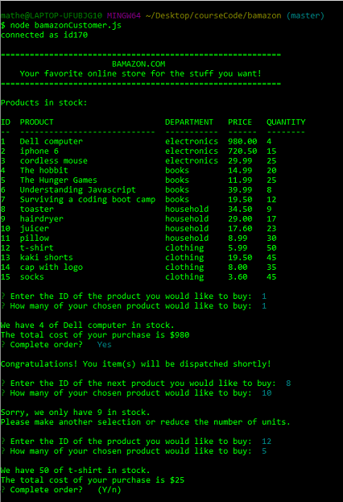
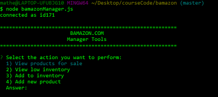
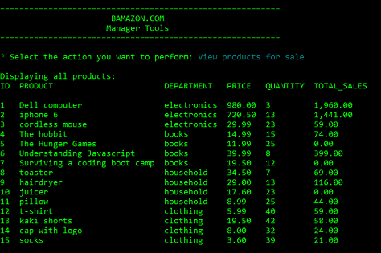
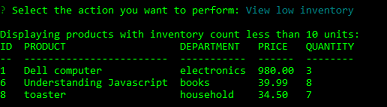
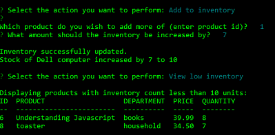
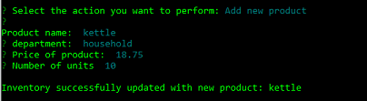
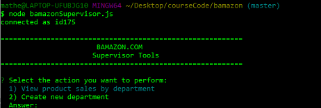
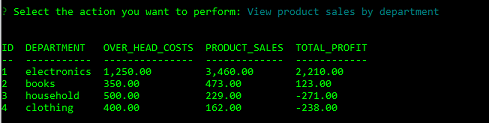

# bamazon online store
## Week 13 homework. Online store with mySQL
.


### Introduction and instructions. ###

bamazon is an online store run from the command line. 
It uses mysql database to store product details and track sales. 
It has 3 portals:
1. Customer portal ```node bamazonCustomer.js``` where customers can view the products on sale and select a product to buy.
2. Manager portal ```node bamazonManagewr.js``` where the store manager can view the list of products, view any items with a low inventory and add both new inventory to existing products and add a completely new product if needed.
3. Supervisor portal ```node bamazonSupervisor.js``` where the bamazon supervisor can review the prifitability of each individual department and create new departments as required. 
.


### Customer portal ### 

Enter the customer portal from the command line with ```node bamazoncustomer.js```.  
The app displays a loist of all the products for sale with department, price and quantity available  
The user is immediately prompted to select an item to purchase.   
Purchases are made by selecting the ID of the product, then the amount. The app checks the stock quantity and returns a failure message if there are not enough items in stock to satisfy the order.   
Otherwise the customer is informed of the total cost of the order (item price * quantity purchased) and asked for a confirmation.   
The screenshot below of ```node bamazonCustomer.js``` demonstrates this functionality.  




### Manager portal ###

On entering the bamazon manager portal at ```node bamazonmanager.js``` the bamazon store manager is presented with a selection of actions they can perform:  


.  
.  

The manager can print out the inventory, which for the manager includes a column for total product sales.  
In the screenshot below notice how the stock quantity for Dell computers has been reduced by 1 (and T-shirts by 10) following our above purchases.  


.  
.  

The manager can view low inventory, in this case set to items with less than 10 units in stock.
This used the mySQL query:
 ```
 "SELECT item_id AS ID, item_name AS PRODUCT, department_name AS DEPARTMENT, FORMAT(price, 2) as PRICE, 
 stock_quantity AS QUANTITY FROM products WHERE (stock_quantity < 10) ORDER BY ID"
```


.  
.  

The manger can then add stock to the inventory of any item.  
Notice how Dell computers no longer shows up in the low inventory search after we added 7 new units to the stock.


.  
.  

The manager can also add a new prodcut to the inventory.



.  
.  
### Supervisor portal ###

The bamazon supervisor wants to know how well each department within the store is performing.
They have access to the 'departments' database in order to do this.   
On accessing the superviser app ```node bamazonSupervisor,js``` they are presented with a menu of choices:


.  
.  

By selecting option 1 to view product sales by department, they can see how profitably each department is performing.  
This requires GROUPing together the products by department, then calculating the profit of each department as the difference between the over_head_costs for the department (from the departments database) and the SUM of the 'product_sales' by deapartment (from the products database) via an INNER JOIN USING the department_name column. 
The mySQL query to do this  was: 

```   
"SELECT d.department_id AS ID, d.department_name AS DEPARTMENT,   
FORMAT(d.over_head_costs, 2) AS   OVER_HEAD_COSTS,   
FORMAT(SUM(p.product_sales), 2) AS PRODUCT_SALES,   
FORMAT((SUM(p.product_sales) - d.over_head_costs), 2) AS TOTAL_PROFIT   
FROM departments AS d   
INNER JOIN products AS p   
USING (department_name)   
GROUP BY (d.department_name) ORDER BY (d.department_id)"  
```  

This gives the following output (the supervisor can see that electronics is very profitable, while clothing and household are performing poorly and losing money):


.  
.  

### NPM Packages ###

1. npm install inquirer (command line data entry)
2. npm install mysql (interfacing node with mysql)
3. npm install console-table (for formatting tables on the command line)

# Copyright

Mathew Hall (C) 2018. All Rights Reserved.


